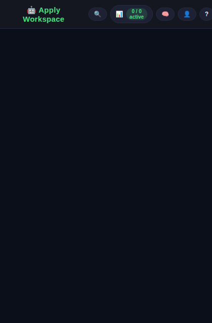
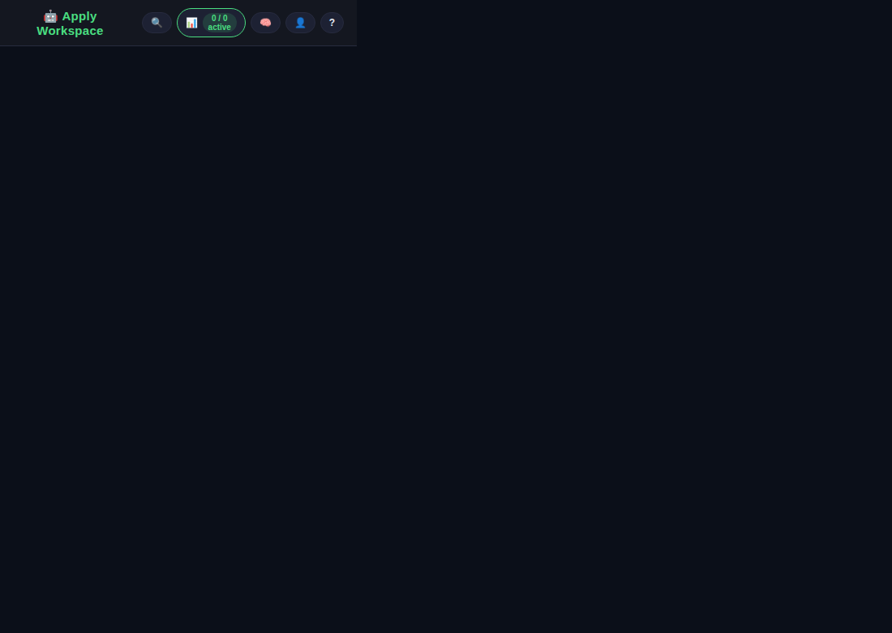
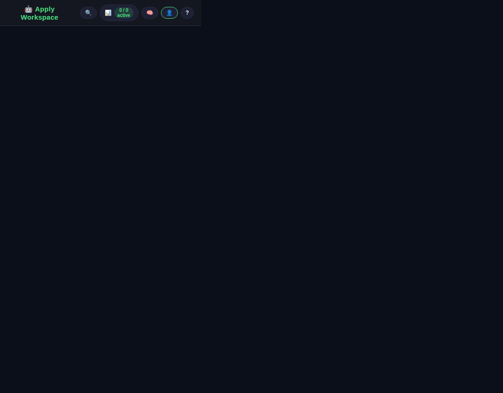

# 🤖 apply-bot — Free AI Job Application Chrome Extension

> Upload your resume once. Land on any job page. Hit apply. Done.

No Docker. No server. No subscription. No bullshit.

---

## The Problem

Job applications are the same 20 questions on 47 different forms.
Nobody has time for that. Nobody should have to.

---

## The Solution

A Chrome extension that:
1. **Learns your resume** once (PDF/Word/paste — Gemini reads it)
2. **Detects job application forms** automatically
3. **Reads the JD** from the page
4. **Generates tailored answers** per role using free Gemini API
5. **Fills the form** in place — you just review and submit

**Free. Local. Private. Fast.**

---

## Quick Start (< 5 minutes)

1. Clone this repo (or download as ZIP)
2. Open `chrome://extensions` → enable **Developer mode**
3. Click **Load unpacked** → select the repo folder
4. Click the 🤖 icon → paste your [free Gemini API key](https://aistudio.google.com/app/apikey) and leave the model on **Auto**
5. Upload your resume (PDF, DOCX, or paste text)
6. Navigate to a job page → click the icon → **Fill This Application**

---

## Project Structure

```
apply-bot/
├── manifest.json          # Chrome MV3 manifest
├── popup/                 # Extension popup UI
│   ├── popup.html
│   ├── popup.js
│   └── popup.css
├── screenshots/           # README gallery assets
├── content/               # Runs on job pages
│   └── content.js         # Form detection + injection
├── background/
│   └── service-worker.js  # API calls, storage management
├── lib/
│   ├── gemini.js          # Gemini API wrapper
│   ├── resume-parser.js   # Resume structuring
│   ├── jd-parser.js       # JD extraction
│   ├── form-filler.js     # DOM injection
│   └── tracker.js         # Application tracking
├── data/
│   └── field-map.json     # Common field name → answer key mappings
└── icons/                 # Extension icons
```

---

## Supported ATS Platforms

| Platform | Detection | Form Fill | Status |
|----------|-----------|-----------|--------|
| Greenhouse | ✅ | ✅ | Phase 1 |
| Ashby | ✅ | ✅ | Phase 1 |
| Lever | ✅ | ✅ | Phase 1 |
| LinkedIn Easy Apply | ✅ | ✅ | Phase 1 |
| Workday | ✅ | 🔄 | Phase 2 |
| iCIMS | ✅ | 🔄 | Phase 2 |
| Generic (any form) | ✅ | 🔄 | Phase 2 |

---

## Screenshots

> Maintenance note: after any significant popup, tracker, or profile UI update, regenerate these images so the README stays current.

### Main dashboard



### Tracker workspace



### Profile + Memory



---

## CSV Import for Tracker History

Use **Tracker → Import CSV** to bring in past applications from another sheet or export.
Accepted headers are case-insensitive and can include:

- `Company`
- `Role Title` / `Title`
- `Status`
- `Date`
- `Employment Type`
- `Remote`
- `Location`
- `Salary Range`
- `Scorecard`
- `Verdict`
- `URL`
- `Notes`

Example header row:

```csv
Company,Role Title,Status,Date,Employment Type,Remote,Location,Salary Range,Scorecard,Verdict,URL,Notes
```

---

## Tech Stack

- **Chrome MV3** extension
- **Auto-selected Gemini 2.5 models** via REST API (`models.list` + fallback strategy)
- Data is stored locally in `chrome.storage.local`; external requests only go to the Gemini API using your key.  

- Zero dependencies, zero build step — just load and use

---

## Storage Schema

```json
{
  "resume": {
    "structured": { "name": "", "email": "", "skills": [], "experience": [], ... },
    "excerpt": "plain-text excerpt (≤1000 chars, null for binary uploads)"
  },
  "settings": {
    "gemini_api_key": "...",
    "preferred_salary_min": 150000,
    "preferred_salary_max": 325000,
    "work_authorization": "US Citizen",
    "preferred_remote": true
  },
  "applications": [
    {
      "id": "uuid",
      "company": "Anthropic",
      "title": "IT Systems Engineer",
      "url": "...",
      "status": "applied",
      "date": "2026-04-04",
      "jd_snippet": "...",
      "answers_generated": true
    }
  ]
}
```

---

## Privacy

- Your resume and API key are stored **only** in your local browser storage.
- The only external network call is to the Gemini API with your own key.
- No servers, no accounts, no telemetry.

---

## License

MIT — built because filling out the same form 47 times is beneath everyone. 🤙